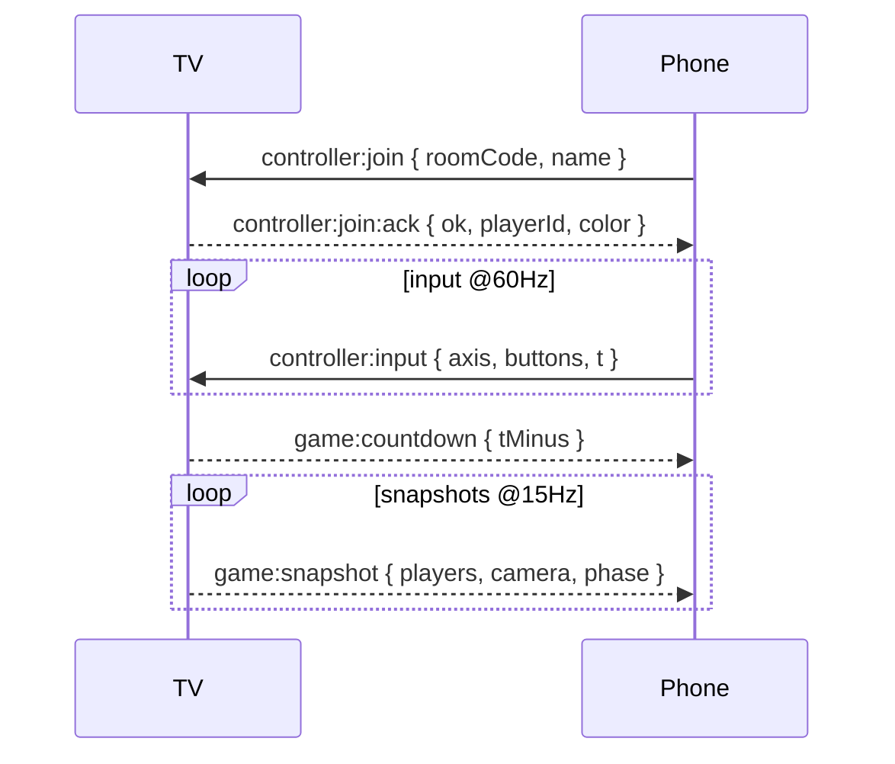

### SpeedGrapplers: React‑Three‑Fiber Multiplayer Party Racer (Spec)

#### Overview
SpeedGrapplers is a couch/party racer inspired by SpeedRunners, built with React Three Fiber for rendering and a single authoritative "TV" client that hosts physics and gameplay. Players join from their phones at `/controller` and use a virtual analog stick plus action buttons. Realtime comms use Socket.IO over WebSockets on the local network.

#### Goals
- **Fast, responsive gameplay** with minimal perceived latency on controllers.
- **Simple join flow**: scan a QR on the TV → land on `/controller?room=XXXX` → play.
- **Authoritative game state** on the TV for consistency; phones act as thin input devices.
- **2.5D side‑scroller** feel with grappling, sliding, items, and elimination by camera.

#### Non‑Goals
- No dedicated headless server initially. The TV (laptop) hosts the room.
- No netcode for remote internet play; LAN only to start.

---

### Architecture
- **TV App (host)**: React 18 + React Three Fiber (R3F) renderer, state via Zustand, physics via `react-three-rapier`. Runs the authoritative simulation and renders the game.
- **Controller App (clients)**: React PWA at `/controller` with virtual analog stick and buttons. Connects to the host via Socket.IO client.
- **Server process**: Single Node.js/Express server on port `4000` hosts Socket.IO at `/socket.io`. In production it also serves the Vite `dist/` bundle. In development Vite runs on `5173` and proxies Socket.IO to `http://localhost:4000`.

#### Routes
- `/` (TV): Game screen, lobby, room code, QR code, scoreboard, settings.
- `/controller`: Mobile controller UI. Orientation locked to landscape.

#### Locked Stack
- **Runtime**: Node.js 20.x, pnpm
- **Language**: TypeScript (strict), ESLint + Prettier
- **Build**: Vite
- **Routing**: React Router 6
- **Styling**: Tailwind CSS 3.4
- **Renderer**: react-three-fiber + @react-three/drei
- **Physics**: react-three-rapier
- **State**: Zustand
- **Assets**: GLTF (grapple anchors via named empties)
- **Networking**: Socket.IO (WebSocket), server at `:4000`
- **PWA**: vite-plugin-pwa for `/controller` only

---

### Networking Model (Socket.IO)
Authoritative TV host. Controllers send compact inputs at 60 Hz; host simulates at 60 Hz and broadcasts state snapshots at 15 Hz for HUD/use on controllers.

#### Rooms
- Each TV session has a `roomCode` (e.g., 4 chars base32). Controllers join that room.
- TV displays a QR to `http://<tv-host>:<port>/controller?room=ABCD`.

#### Namespaces/Channels
- Single namespace `/game`. Use rooms per session.

#### Wire Protocol (final v1)
```ts
type PlayerId = string;      // server-side canonical id (socket.id mirror)
type RoomCode = string;      // 4-char base32, e.g., "ABCD"

type ControllerJoin = {
  roomCode: RoomCode;
  displayName?: string;
  reconnectionToken?: string; // for reconnecting same player
};

type JoinAck = {
  ok: boolean;
  reason?: string;
  playerId?: PlayerId;
  color?: string;             // hex
  reconnectionToken?: string;
};

type ButtonsBitmask = number; // 5 bits: 1=jump, 2=grapple, 4=slide, 8=item, 16=pause

type InputPayload = {
  t: number;                  // client ms timestamp (Date.now)
  ax: number;                 // analog x in [-127..127] int8
  ay: number;                 // analog y in [-127..127] int8
  buttons: ButtonsBitmask;    // current held state bitmask
  pressed?: ButtonsBitmask;   // edges (pressed this frame)
  released?: ButtonsBitmask;  // edges (released this frame)
};

type PlayerSnapshot = {
  id: PlayerId;
  name: string;
  color: string;
  pos: [number, number, number];
  vel: [number, number, number];
  facing: 1 | -1;
  state: 'running' | 'jumping' | 'sliding' | 'grappling' | 'stunned' | 'eliminated';
};

type GameStateSnapshot = {
  t: number; // host time
  phase: 'lobby' | 'countdown' | 'race' | 'results';
  players: PlayerSnapshot[];
  camera: { pos: [number, number, number]; zoom: number };
  lap?: { current: number; total: number };
};

// Socket.IO events
// Controller → Host
// 'controller:join'        : ControllerJoin
// 'controller:input'       : InputPayload @60Hz (auto downshift to 30Hz if needed)

// Host → Controller
// 'controller:join:ack'    : JoinAck
// 'controller:haptics'     : { pattern: 'tick' | 'hit' | 'boost' }
// 'controller:toast'       : { text: string }

// Host → All controllers (room)
// 'game:snapshot'          : GameStateSnapshot @15Hz
// 'game:countdown'         : { tMinus: number }
// 'game:result'            : { placements: PlayerId[] }
```

#### Latency Strategy
- Controllers send inputs with timestamps. Host applies immediately and keeps a short input history per player for reconciliation if needed.
- Controllers render minimal local UI only. No world render on phones, just input feedback.
- Host simulates and renders at 60 Hz; broadcasts snapshots at 15 Hz for HUD and consistency.

---

### Controller UX (Mobile)
- **Layout**: Landscape, full-screen PWA.
  - Left side: virtual analog stick (thumbpad). Deadzone `0.12`, max radius `90px`.
  - Right side: 4 buttons: Jump (A), Grapple (X), Slide (B), Item (Y). Big, spaced, with hold/edge states.
- **Feedback**: Haptics via Vibration API (pattern: tick/hit/boost); color tint matches assigned player color.
- **Connection**: Displays room join status; reconnect/backoff; input rate indicator.
- **Accessibility**: Left/right swap option for southpaw; button reorder; adjustable deadzone.
- **Performance**: Pointer events, passive listeners, RAF-batched input, send at 60 Hz (auto downshift to 30 Hz on low bandwidth). Quantize stick to int8 `[-127..127]`.

Implementation notes:
- Provide a `useControllerInput` hook that aggregates pointer/button state per RAF tick and emits compact `InputPayload`s with bitmasks and int8 axes.

---

### TV Client (Game)
#### World and Camera
- 2.5D side-scroller track (procedural or hand-authored). Lock motion to X/Y plane; Z fixed.
- Dynamic following camera that biases toward the lead pack; screen bounds eliminate lagging players.
- Elimination circle or camera margin shrink to force pace.

#### Players and Abilities
- Movement: run with acceleration, coyote time on jumps, variable jump height.
- Slide: low friction, duck under obstacles, preserves momentum.
- Grapple: aim with stick angle; auto-attach to nearby grapple nodes within cone + range; pendulum swing with rope constraints.
- Items: pickups grant single-use effects (speed boost, shockwave, trap). Keep initial set small.

#### Physics
- `react-three-rapier` for performance and stable constraints.
- Lock Z translation/rotation to simulate 2D.
- Grapple uses a joint constraint for physics and a lightweight rendered rope (verlet/rod) for visuals.
- Continuous collision detection for fast players; swept tests for slides.

#### Rendering
- R3F with instanced meshes for repeated props, baked lighting or simple PBR.
- UI overlays via `<Html />` for HUD, countdown, placements.
- Postprocessing minimal (vignette, slight bloom) with toggle for low-spec.

#### Game Loop
- Phases: Lobby → Countdown (3..2..1) → Race → Results.
- Race ends when only one player remains on-screen or finish line crossed.
- Between rounds, quick rematch; keep players in room.

---

### Lobby and Join Flow
1. TV generates `roomCode` and starts Socket.IO room.
2. TV shows QR linking to `/controller?room=XXXX` and direct IP/hostname.
3. Controller loads, submits `controller:join` with name.
4. TV acks, assigns color/avatar, shows player card in lobby.
5. Host can start when ≥2 players ready.

---

### Data and State
- Use Zustand/Jotai for local UI state; game sim state owned by a single store.
- Keep network layer isolated via a `GameNetworking` module exposing typed emit/on helpers.
- Deterministic random seed per round for item spawns.

---

### Error Handling and Resilience
- Reconnect with exponential backoff; restore `playerId` via token stored on the controller.
- Hot-join mid-lobby; mid-race join spectates until next round.
- Host migration (future): elect a new TV if host disconnects (out of scope v1).

---

### Security
- Accept connections only from local network by default.
- Validate `roomCode`, throttle input events per socket, discard malformed payloads.

---

### Performance Targets
- TV: 60 FPS render, 60 Hz physics.
- Controllers: ≤ 2 kB/s per client at 30–60 Hz input rate (int8 axes, bitmask buttons).
- Snapshot broadcast: 15 Hz, with future delta compression for positions/velocities.

---

### Assets and Levels (final)
- **Art style**: Low‑poly, flat colors.
- **No Blender required for v1**. Gameplay geometry is generated from JSON primitives; GLTF is used only for optional decor.

- **Sources (CC0)**
  - `@pmndrs/assets` (npm): HDRIs, matcaps, normals, fonts, models. Use dynamic imports to avoid bundling.
  - Quaternius packs (GLTF): Ultimate Platformer + Modular Platformer for decor/props.
  - Kenney packs: UI icons and SFX.
  - Poly Haven HDRIs: optional extras; prefer `@pmndrs/assets` packaged EXRs in code.

- **Level format (JSON)**
  - Stored at `src/client/assets/levels/<levelId>.json`.
  - Defines primitive gameplay geometry, grapple anchors, spawns, and optional decor placements.
  - Colliders are implicit from primitives; no runtime mesh cooking.

```json
{
  "version": 1,
  "meta": { "id": "intro_01", "difficulty": 1 },
  "tiles": [
    { "type": "box",  "pos": [0,0,0],   "size": [12,1,2] },
    { "type": "ramp", "pos": [12,0,0],  "size": [6,1,2], "angleDeg": 15 },
    { "type": "ceil", "pos": [0,6,0],   "size": [10,1,2] }
  ],
  "anchors": [
    { "pos": [6,5,0], "radius": 1.2, "coneDeg": 55, "autoRange": 12 }
  ],
  "spawns": [ { "pos": [1,2,0] }, { "pos": [1.5,2,0] }, { "pos": [2,2,0] }, { "pos": [2.5,2,0] } ],
  "decor": [
    { "id": "tree_lp_a", "pos": [2,-1,-3], "rotY": 0.6, "scale": 1.2 }
  ]
}
```

- **Decor manifest**
  - `src/client/assets/assets.manifest.json` maps decor `id` → local GLB path.
  - Example:
```json
{
  "decor": {
    "tree_lp_a": "/assets/vendor/quaternius/ultimate-platformer/tree_lp_a.glb",
    "rock_lp_a": "/assets/vendor/quaternius/ultimate-platformer/rock_lp_a.glb"
  },
  "hdris": {
    "city": "@pmndrs/assets/hdri/city.exr"
  }
}
```

- **R3F loading**
  - Environment: `@pmndrs/assets` EXR via dynamic import + `<Environment files={suspend(exr)} />`.
  - Decor: `<Gltf src={path} />` for manifest‑resolved ids.

- **Validation**
  - A small `tools/levels/validate.ts` script checks JSON schema, tile intersections, and anchor spacing.

---

### Asset Fetch Task
- Script: `tools/assets/fetch.ts`
  - Downloads curated Quaternius GLTFs and places them under `src/client/assets/vendor/quaternius/...`.
  - Optionally downloads selected Poly Haven HDRIs to `src/client/assets/hdris` (v1 prefers `@pmndrs/assets`).
  - Writes/updates `assets.manifest.json` with available decor ids.
- NPM scripts:
  - `pnpm assets:fetch` → run fetcher
  - `pnpm assets:verify` → validate presence and sizes

---

### Minimal Event Flows


---

### Folder Layout (final)
```
/src
  /server
    express.ts
    sockets.ts
    events.ts         // shared types (source of truth)
  /client
    main.tsx
    router.tsx
    /routes
      /tv
        TVApp.tsx
        GameHost.tsx
        HUD.tsx
        CameraRig.tsx
      /controller
        ControllerApp.tsx
        ControllerPad.tsx
        Buttons.tsx
    /game
      Simulation.ts
      Physics.ts
      Grapple.ts
      Items.ts
      constants.ts
    /net
      socketClient.ts
      useNetworking.ts
    /state
      useGameStore.ts
      useControllerStore.ts
    /assets
      /levels
        intro_01.json
      /vendor
        /quaternius
          /ultimate-platformer
            tree_lp_a.glb
        /hdris
          city.exr (optional, prefer @pmndrs/assets dynamic import)
      assets.manifest.json
  /shared
    events.ts         // consumed by server/client via TS path alias
/tools
  /assets
    fetch.ts
  /levels
    validate.ts
```

---

### Milestones
- M0: Skeleton app, Socket.IO roundtrip, controller connects and echoes input.
- M1: Basic player movement/jump/slide; camera follow; elimination bounds.
- M2: Grapple prototype; rope visual; swing mechanics.
- M3: Items and pickups; simple track; results screen.
- M4: Polished controller UI, haptics, accessibility; performance passes.

---

### Acceptance Criteria (v1)
- Up to 4 players can join from phones, see assigned colors, and control their runners.
- TV simulates physics and renders the race at ≥ 60 FPS.
- Elimination by camera works; one winner per round; rematch flow.
- Controller latency feels snappy (≤ 60 ms one-way on typical LAN), with haptic feedback on key events.

---

### Concrete Defaults
- Deadzone: `0.12`
- Stick radius: `90px`
- Axes quantization: int8 `[-127..127]`
- Button order: Jump=A (bottom), Grapple=X (left), Slide=B (right), Item=Y (top)
- Room code: 4 chars, uppercase base32 (A–Z, 2–7)
- Ports: `4000` (server, prod+dev), `5173` (Vite dev)
- Max players: `4`
- Single level for v1: JSON primitives + anchors; decor from Quaternius GLTF via manifest


---

### Gameplay Tuning (v1 defaults)
- Movement
  - Gravity: `-35 m/s^2` (Y)
  - Run acceleration: `28 m/s^2` up to Max speed `12 m/s`
  - Air control factor: `0.6`
  - Ground friction: `6`
  - Air friction: `0.1`
  - Jump: coyote time `120 ms`, buffer `120 ms`, min hold `80 ms`, max hold `220 ms`
  - Jump velocity base: `10 m/s`, extra per hold: `+3 m/s` capped
- Slide
  - Enter on button when grounded and below ceiling clearance
  - Slide friction: `1.2` (low), exit speed threshold `4 m/s`
- Grapple
  - Max range: `12 m`
  - Acquire cone: `55°`
  - Rope length: clamp to target distance, spring freq `6 Hz`, damping ratio `0.6`
  - Release on button or auto if rope angle behind player > `100°`
- Colliders
  - Player: capsule radius `0.35`, height `1.6`
  - Tiles: all static, CCD on player enabled

---

### Camera & Elimination
- Follow
  - Track the centroid of the front 50% of active players
  - Lead bias: +`2.0 m` along X toward leading player
  - Smooth: critically damped spring, freq `3 Hz` (position), `1.5 Hz` (zoom)
  - Zoom range: `min=8 m`, `max=18 m` to keep all active players in frame with padding `20%`
- Elimination
  - Kill margin: if player leaves safe frame by `>12%` viewport for `>0.8 s` → eliminate
  - Sudden‑shrink: if no elimination for `15 s`, reduce padding by `1%/s` to `min=8%`
  - Round ends when one remains or finish trigger is crossed

---

### Items (v1 set)
- Boost: +`60%` speed for `1.5 s`, additive accel, immunity to slide friction; cooldown `8 s`
- Shockwave: radial impulse `8 m` radius, apply `6 m/s` outward, stuns `0.4 s` in air; self immune for `0.3 s`
- Trap: place on ground, active for `10 s`, triggers slide and slow `40%` for `1.2 s`
- Pickups spawn on predefined markers; no stacking—one item slot per player.

---

### Controller UX Metrics
- Layout
  - Stick area: left 45% width, full height
  - Buttons area: right 55% width
  - Stick radius: `90 px`, deadzone: `0.12`, outer deadband: `0.05`
  - Buttons: circles min `72 px` on short side, spacing `12–16 px`
- Input
  - Pointer events only; `touch-action: none`; `passive: false` on handlers to allow preventDefault
  - Sampling at `RAF`; emit at `60 Hz` or `30 Hz` when throttled
  - Haptics: Vibration API patterns { tick: `[10]`, hit: `[20, 30, 20]`, boost: `[10, 10, 10, 10]` }
- Options
  - Southpaw swap; deadzone slider `0.08–0.2` (default `0.12`)

---

### Rooms, QR, and Host Discovery
- Room codes: uppercase base32, 4 chars; uniqueness per host process
- Host discovery: enumerate local IPv4 non‑internal interfaces; choose first private range; display all as fallbacks
- QR code: `http://<ip>:4000/controller?room=ABCD`
- Reconnect: `reconnectionToken` stored in controller localStorage; on connect, server re‑binds to prior `playerId` if room active
- Time sync: host emits `t` in snapshots; controllers compute `offset` via ping every `5 s`

---

### Networking Quotas & Validation
- Rate limit per socket: soft `120 msgs/s`, hard drop above `200 msgs/s`
- Payload caps: inputs ≤ `12 bytes` typical (t,u16, ax,i8, ay,i8, buttons,u8)
- Schema: Zod on both ends; discard out‑of‑range values; clamp axes to int8
- Heartbeat: rely on Socket.IO ping/pong; kick inactive after `8 s` silence in race phase

---

### PWA and Mobile Behavior (Controller)
- Installable PWA: manifest + service worker; display `standalone`; orientation `landscape`
- iOS caveat: orientation lock is best‑effort; show instruction overlay if portrait
- Prevent sleep: use small periodic vibrations if permitted or Screen Wake Lock API when available

---

### Dev Workflow & Commands
- Dev servers
  - `pnpm dev`: Vite on `5173` with proxy to `:4000`
  - `pnpm server`: Express/Socket.IO on `4000`
- Build
  - `pnpm build`: Vite build → `dist/`
  - `pnpm serve`: Express serves `dist/` and Socket.IO
- Env
  - `.env`: `PORT=4000`, `VITE_SOCKET_URL` (dev), `VITE_DEFAULT_HDRI=city`

---

### Testing Checklist (v1)
- Controllers
  - Join/leave/reconnect; southpaw; deadzone slider; haptics fire on events
- Network
  - 2–4 players stable at 60 Hz inputs; snapshot 15 Hz; rate limiting enforced
- Gameplay
  - Coyote/jump buffering behave; slide under obstacles; grapple acquire/release rules
  - Camera keeps pack framed; elimination triggers reliably; sudden‑shrink ends stalemates
- Items
  - Boost speed/decay; shockwave impulse/stun; trap placement/collision
- Performance
  - TV ≥ 60 FPS on target laptop GPU; GC spikes under 8 ms; mobile controllers ≤ 2% CPU when idle

---

### Non‑Functional
- Language: English only v1; no analytics/telemetry
- Privacy: no PII; display names stored only in memory on host
- Logging: debug overlay toggle on TV (`?debug=1`) showing FPS, players, net rates

---

### Additional Implementation Details
- Coordinates & units
  - X right, Y up, Z toward camera; 1 unit = 1 meter; player origin at feet center.
- Simulation step order (60 Hz)
  1) Read most recent input per player (drop stale/out-of-order by `t`) 2) Integrate movement 3) Solve grapple constraints 4) Collisions/CCD 5) Items/effects 6) Elimination checks 7) Emit snapshot (15 Hz).
- Determinism & PRNG
  - Fixed-rate physics at 60 Hz; render decoupled. Seeded RNG per round for items/spawns.
- Input handling & validation
  - Server enforces monotonic timestamps per socket; clamp stick to int8; Zod-validate payloads; ignore invalid ranges.
- Host controls
  - Start/stop round, kick player, lock room during race, rematch, reset level; late joins spectate until next round.
- Room lifecycle
  - One active room per host process; room closes on host exit; auto-clean players after `>8 s` disconnect.
- Discovery & QR fallbacks
  - Display all private IPv4s and copyable URL; manual room code entry; troubleshooting tips (same Wi‑Fi, firewall).
- Accessibility
  - Colorblind-safe palette; scalable UI (S/M/L); haptics toggle; high-contrast mode (controller).
- Mobile safe areas
  - Respect `env(safe-area-*)`; `display: standalone`; landscape best-effort on iOS with portrait overlay.
- Audio/SFX
  - CC0 Kenney SFX; unlock audio on first tap; mixer with master volume persisted locally.
- Performance guards
  - Cap DPR to `1.5`; dynamic resolution drop if frame time > `22 ms` for `>1 s`; disable postfx under sustained load.
- Error UI
  - Clear toasts for join failed (room/full/locked), reconnecting, version mismatch (if any).
- Security/abuse
  - Kick/ban per socket (session-scoped); randomize player color; throttle any chat if added.
- Level schema versioning
  - JSON `version` field; validator supports minor migrations; CI check for schema and collider overlaps.
- Finish logic
  - Winner by last-in-frame or finish trigger; ties resolved by X position then time-in-frame.
- Snapshot payload bounds
  - Max players 4; floats rounded to 2 decimals if needed; snapshots ≤ 4 KB.
- Browser support
  - Chrome 105+, Safari iOS 15+, Firefox 102+; WebGL2 preferred with WebGL1 fallback; show unsupported message.
- Persistence
  - Controller: name, southpaw, deadzone, last room, reconnection token in localStorage. TV: runtime-only settings in memory.


